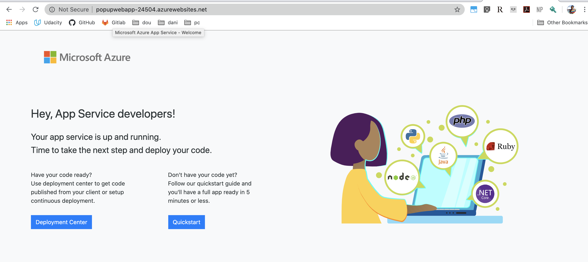

# Create a Web App

## 1. First, create the resource group (previous doc)

Previusly set variables 

        export RESOURCE_GROUP=learn-a0e21289-da33-4e61-8b7f-fd155b77de3d
        export AZURE_REGION=centralus
        export AZURE_APP_PLAN=popupappplan-$RANDOM
        export AZURE_WEB_APP=popupwebapp-$RANDOM

## 2. Create an App Service plan to run your app

> az appservice plan create --name $AZURE_APP_PLAN --resource-group $RESOURCE_GROUP --location $AZURE_REGION --sku FREE

List the app services
> az appservice plan list --output table

## 3. Create a web app

> az webapp create --name $AZURE_WEB_APP --resource-group $RESOURCE_GROUP --plan $AZURE_APP_PLAN

Verify the app exists 

> az webapp list --output table

Note the default host name

In this example it's: popupwebapp-24504.azurewebsites.net

A default landing page by azure is waiting for you: 
 

You can also curl the site.
> curl $AZURE_WEB_APP.azurewebsites.net

