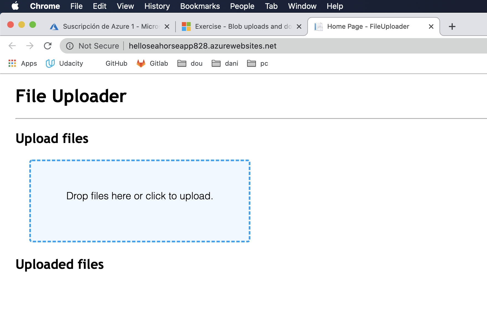

# Blob storage on Azure

Storage account creation is an administrative/management activity that takes place prior to deploying and running your app

Container creation is a lightweight activity that makes sense to perform from within an app. 

## 1. Create a storage account

It has to have a unique name, with only lowercase letters and numbers.

> az storage account create \
  --kind StorageV2 \
  --resource-group learn-9d4821ca-a044-42b1-ad77-2ec4b3cc978a \
  --location centralus \
  --name [your-unique-storage-account-name]

name : helloseahorse828

StorageV2 is the general purpose account but it's not the default.

## Container 

It is a best practice to let the container be created automatically at startup of the app. Just to lern more, you can use this command

> az storage container create -h

## Typical workflow for apps that use blob storage

1. Retrieve configuration: At startup, load the storage account configuration. This is typically a storage account connection string.

2. Initialize client: Use the connection string to initialize the Azure Storage client library. This creates the objects the app will use to work with the Blob storage API.

3. Use: Make API calls with the client library to operate on containers and blobs.

**Security**

Storage account connection strings include the account key. The account key is considered a secret and should be stored securely. 

Standard pattern in C# 

        CloudStorageAccount storageAccount = CloudStorageAccount.Parse(connectionString); // or TryParse()
        CloudBlobClient blobClient = storageAccount.CreateCloudBlobClient();
        CloudBlobContainer container = blobClient.GetContainerReference(containerName);

## 2. Clone and explore an unfinishedd app

> git clone https://github.com/MicrosoftDocs/mslearn-store-data-in-azure.git

> cd mslearn-store-data-in-azure/store-app-data-with-azure-blob-storage/src/start

Opens visual studio code
> code .

Blob storage is a library for C#, ensure you have the newest version.

> dotnet add package WindowsAzure.Storage

> dotnet restore

----

I will not continue documenting as this is very specific foor C#. I need a python example...

## 3. Deploy and run in Azure

Create an App Service app and configure it with application settings for our storage account connection string and container name.

Get connection string 
> az storage account show-connection-string --name helloseahorse828

        "connectionString": "DefaultEndpointsProtocol=https;EndpointSuffix=core.windows.net;AccountName=helloseahorse828;AccountKey=fjxGUvbnnv16r7n8ZJSSpxTRO9vvz0LJl4OkNk3m2tdhMJJOTZXD6Z3U5MAN6A4YDKIYG+TT2A8rQdKW9F/Dqw=="

Create app service plan
> az appservice plan create --name blob-exercise-plan --resource-group learn-9d4821ca-a044-42b1-ad77-2ec4b3cc978a --sku FREE --location centralus

Create web app

> az webapp create --name helloseahorseapp828 --plan blob-exercise-plan --resource-group learn-9d4821ca-a044-42b1-ad77-2ec4b3cc978a

> CONNECTIONSTRING=$(az storage account show-connection-string --name helloseahorse828 --output tsv)

        DefaultEndpointsProtocol=https;EndpointSuffix=core.windows.net;AccountName=helloseahorse828;AccountKey=fjxGUvbnnv16r7n8ZJSSpxTRO9vvz0LJl4OkNk3m2tdhMJJOTZXD6Z3U5MAN6A4YDKIYG+TT2A8rQdKW9F/Dqw==

> az webapp config appsettings set --name helloseahorseapp828 --resource-group learn-9d4821ca-a044-42b1-ad77-2ec4b3cc978a --settings AzureStorageConfig:ConnectionString=$CONNECTIONSTRING AzureStorageConfig:FileContainerName=files

Publish in c# fashion

> dotnet publish -o pub

> cd pub

> zip -r ../site.zip *

> az webapp deployment source config-zip --src ../site.zip --name helloseahorseapp828 --resource-group learn-9d4821ca-a044-42b1-ad77-2ec4b3cc978a

App is now available at helloseahorseapp828.azurewebsites.net

Query the blobs that have been uploaded 

> az storage blob list --account-name helloseahorse828 --container-name files --query [].{Name:name} --output table

        Name
        ----------------------------
        azurecli.md
        msn_aktuell_T24_Gamescom.pdf
        phpapp.png

It works!

## Knowledge check 

1. Good strategy for creating storage accounts and blob containers for your application:

- Create Azure Storage accounts before deploying your app. Create containers in your application as needed.

2. Which of the following can be used to initialize the Blob Storage client library within an application?

- The Azure Storage account connection string

3. What happens when you call GetBlockBlobReference with the name of a blob?

- A CloudBlockBlob object is created locally. No network calls are made.