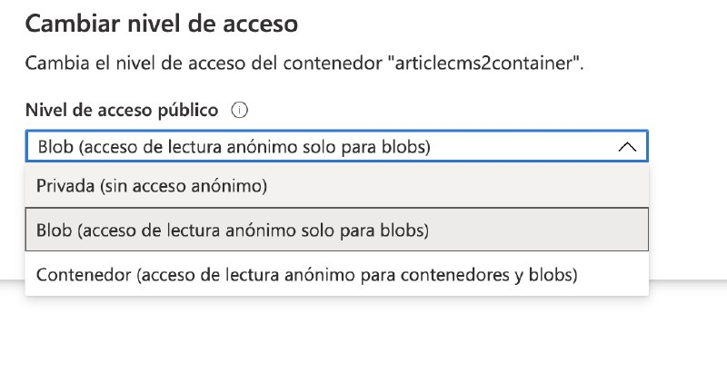
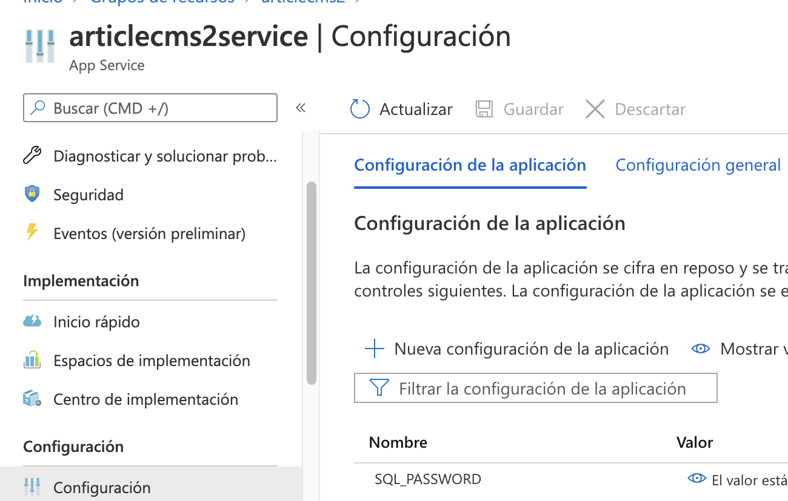

# Article CMS 2

This are my notes for the submission of a project I already did, but with different source code and slightly different instructions.

| Resource|  Name|
| - | - |
| Resource group | articlecms2 |
| Database server| microblogserver |
| Database name| microblog2|
| Database user| hello|
| Database password| seahorse with capital and a number one|
| Storage account name | articlecms2storage |
| Storage container name | articlecms2container|
| App service plan | articlecms2service| 
| Web app | articlecms2service|
| AD Application client id | e2a9f25c-7f73-4d02-bc63-a6d07a7dc3dc|

### 1.1 Create the database

Using the portal's GUI, with the cheapest option.

Open available connections for your laptop's IP address in the firewall configuration.

### 1.2 Connect to the database
> az configure --defaults group=articlecms2 sql-server=microblogserver

> az sql db show-connection-string --client sqlcmd --name microblog2

> sqlcmd -S tcp:microblogserver.database.windows.net,1433 -d microblog2 -U \<username> -P "\<password>" -N -l 30

### ### 1.3 Prepoplate the database

> sqlcmd \<everything previously typed> -i \<path_to/script.sql>

### 2.1 Create blob storage

StorageV2 is the general purpose account
> az storage account create \
  --kind StorageV2 \
  --resource-group articlecms2 \
  --location centralus \
  --name articlecms2storage

### 2.2 Create storage container

Display account keys and store them in env variable.
> az storage account keys list -n articlecms2storage

> az storage container create --name articlecms2container --account-name articlecms2storage --account-key $AZURE_STORAGE_KEY

Research the argument to make it public, or change it manually in azure portal.

Container / general info / change access level / anonymous read access for blobs

## 3.1 Setup azure active directory in python

https://docs.microsoft.com/en-us/azure/active-directory/develop/quickstart-create-new-tenant

Look for reference here

https://github.com/Azure-Samples/ms-identity-python-webapp

Look for the instructions on "Register the Python Webapp (python-webapp)"

0. Register and app and set the redirect url

1. Identify the tenant id (Azure portal / Active directory / Properties / Tenant ID) or create a new one.

2. Verify read permissions API are set (what this app needs)

3. Save app id and set it in config.py as CLIENT_ID

4. Create a secret and use it as an env var, (both locally and inside the web app for azure). *Bonus*: use a key vault

## 4. To run the python app locally

> source venv/bin/activate

> export FLASK_APP=application.py

> pip install -r requirements.txt

> flask run

## 5. Deploy

Install gunicorn with pip

Add it to the requirements file with the help of pip freeze

Add the startup.txt file with the following line
> gunicorn --bind=0.0.0.0 --workers=4 application:app

Create app service plan and web app (best if they have the same name)

>  az appservice plan create -n articlecms2service --is-linux --sku B1

> az webapp create -p articlecms2service -n articlecms2service --runtime "Python|3.6"

> az webapp config set -n articlecms2service --startup-file "startup.txt"

Deploy manually

> az webapp up -n articlecms2service 

This failed, it might be because the startup.txt is not yet part of the repository
Yep. I think the .git folder is essential to the deploy.

 No module named 'flask_sqlalchemy'
 Are the requirements not installedd automatically? ok, lets go with pipelines.

## 5.2 Deploy with azure pipelines

Create a service connection for the resource group where the app is.

Create a pipeline using the github repo and select python linux web app.

Add the last line of startup command in the pipelines.yml file
> startUpCommand: 'gunicorn --bind=0.0.0.0 --workers=4 application:app'

**Use env var in azure**

This is necessary for the passwords or keys that should not be saved as plain text in your repo.

https://akhilsharma.work/how-to-pass-environment-variables-in-azure-webapps/

Go to web app / application settings / add a setting  ( env var)

## Enable logging

    handler = logging.StreamHandler(stream=sys.stdout)
    handler.setFormatter(logging.Formatter("[%(asctime)s] %(levelname)s in %(module)s: %(message)s"))
    app.logger.addHandler(handler)
    app.logger.setLevel(logging.INFO)
    app.logger.info('Microblog startup')
    app.logger.info(header)
