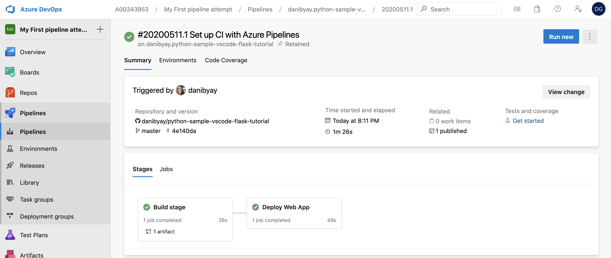
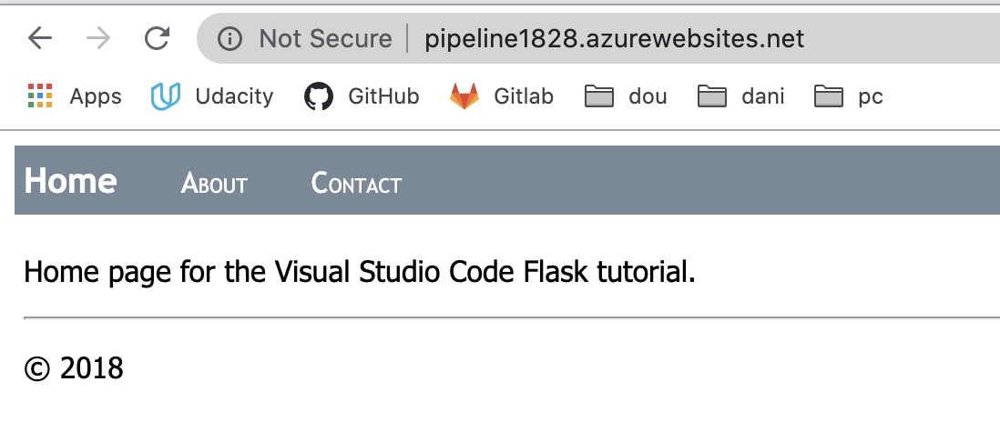

# Create a python web app

Using this example project

https://github.com/danibyay/python-sample-vscode-flask-tutorial

And this tutorial

https://docs.microsoft.com/en-us/azure/devops/pipelines/ecosystems/python-webapp?view=azure-devops

        export RESOURCE_GROUP=x
        export SERVICE_PLAN=y
        export APP_SERVICE=z
        
Pro-tip = name the plan and the service the same

## 1. Create a resource group

> az group create -l <your-region> -n $RESOURCE_GROUP

> az group create --name "holi" --location "east us"

## 2. Create a service plan 

> az appservice plan create -g $RESOURCE_GROUP -n $SERVICE_PLAN --is-linux --sku B1

## 3. Create the web app
 
> az webapp create -g $RESOURCE_GROUP -p $SERVICE_PLAN -n $APP_SERVICE --runtime "Python|3.6"

## 3.1 Config the startup file 

> az webapp config set -g $RESOURCE_GROUP -n $APP_SERVICE --startup-file "startup.txt"

## 3.2 Deploy manually

Clone your repo, and in the console, cd to the repo directory

> az webapp up -n $APP_SERVICE -g $RESOURCE_GROUP -p $SERVICE_PLAN

Visit the page at:

app_service.azurewebsites.net

## 4. Connect the app service to a pipeline

Go to dev.azure.com and create a project or use an existing one.

Go to the Project Settings page, select Pipelines > Service connections, then select New service connection, and then select Azure Resource Manager from the dropdown.

- Give the connection a name. Make note of the name to use later in the pipeline.
- For Scope level, select Subscription.
- Select the subscription for your App Service from the Subscription drop-down list.
- Under Resource Group, select your resource group from the dropdown.
- Make sure the option Allow all pipelines to use this connection is selected, and then select OK.

Name: My pipeline azure connection

## 5. Create a new pipeline

- Where is your code? - Github
- Select the repository
- On the Configure your pipeline screen, select Python to Linux Web App on Azure
- select the app service from the drop down menu. (APP_SERVICE)

A yml will be generated, review it and add this line at the end for the flask startup

> startUpCommand: 'gunicorn --bind=0.0.0.0 --workers=4 startup:app'

or

> StartupCommand: 'startup.txt'.

     - task: AzureWebApp@1
       displayName: 'Deploy Azure Web App : pipeline1828'
       inputs:
         azureSubscription: $(azureServiceConnectionId)
         appName: $(webAppName)
         package: $(Pipeline.Workspace)/drop/$(Build.BuildId).zip
         # this is specific to this flask project
         startUpCommand: 'gunicorn --bind=0.0.0.0 --workers=4 startup:app'

## 6. DONE

